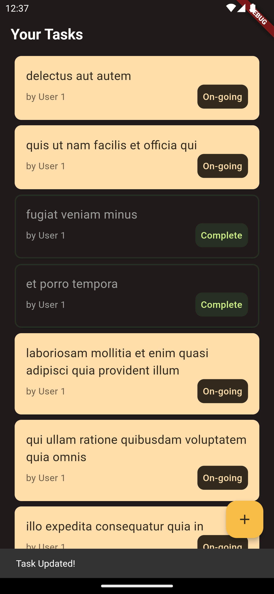
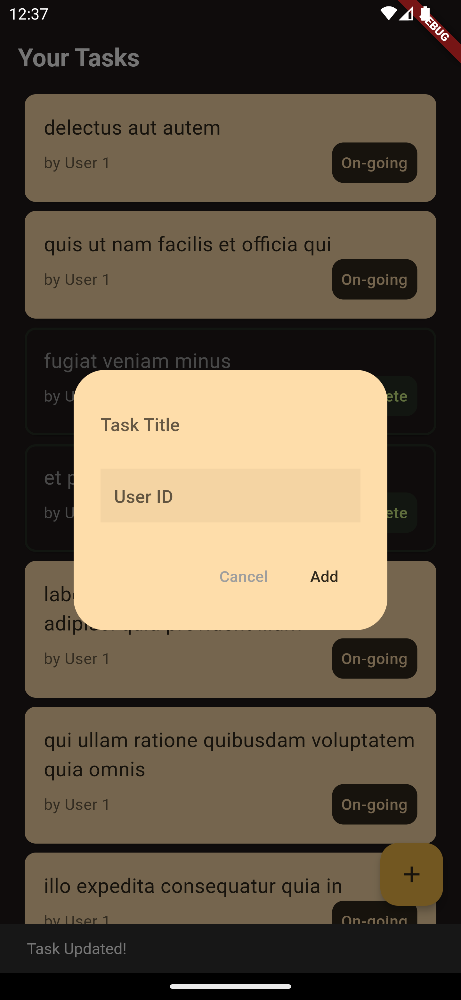

# ToDo App use Material You design and Flutter BLOC

## Getting Started

Flutter Framework was used to construct a simple ToDo App project with Material You colours concept.
Basic ToDo features like Add, Change Status and Fetch from API are included in the app.

## Features
- Fetch ToDo App from API
- Use BLOC as state management
- Add new Task
- Change status from On-Going to Completed
- Automatically generate code for converting to and from JSON by annotating Dart classes by using JSON serializable 
- Use Material 3 design system

## Libraries & Tools Used
- [`build_runner: ^2.3.2`](https://pub.dev/packages/build_runner)
- [`equatable: ^2.0.5`](https://pub.dev/packages/equatable)
- [`flutter_bloc: ^8.1.1`](https://pub.dev/packages/flutter_bloc)
- [`http: ^0.13.4`](https://pub.dev/packages/http)
- [`json_annotation: ^4.7.0`](https://pub.dev/packages/json_annotation)
- [`json_serializable: ^6.5.4`](https://pub.dev/packages/json_serializable)

## Folder Structure
Here is the core folder structure which flutter provides.

```
flutter-app/
|- android
|- build
|- ios
|- lib
|- test
```

Here is the folder structure we have been using in this project

```
lib/
|- blocs/
  |- tasks/
|- model/
|- repositories/
|- widgets/
|- main.dart
```

Now, lets dive into the lib folder which has the main code for the application.

```
1- blocs - Contains blocs file such as state and event of the Task. It also have the main Bloc Task file name as tasks_bloc.dart.
2- model - All the class model are defined in this directory with-in their respective files. This directory contains the constants for `Task` model and Task.g.dart file that have been generated from json_serializable.
3- repositories - This file contains future function to fetch quotes from API.
4- widgets - Contains custom widgets of this project, includes widgets taskWidget and checkBoxesWidget.
5- main.dart - This is the starting point of the application. All the application level configurations are defined in this file i.e, theme, page, title etc.
```

### Model

This directory contains all the application class model. A separate file is created for each type as shown in example below:

```
model/
|- task.dart
|- task.g.dart
```

### Widgets

Contains the common widgets that are shared across multiple screens. For example, Button, Picker etc.

```
widgets/
|- task.dart
|- checkboxes.dart
```

## Screenshots
| Start page | Add New Task |
| ---------------- | ---------------- |
|  |  |

